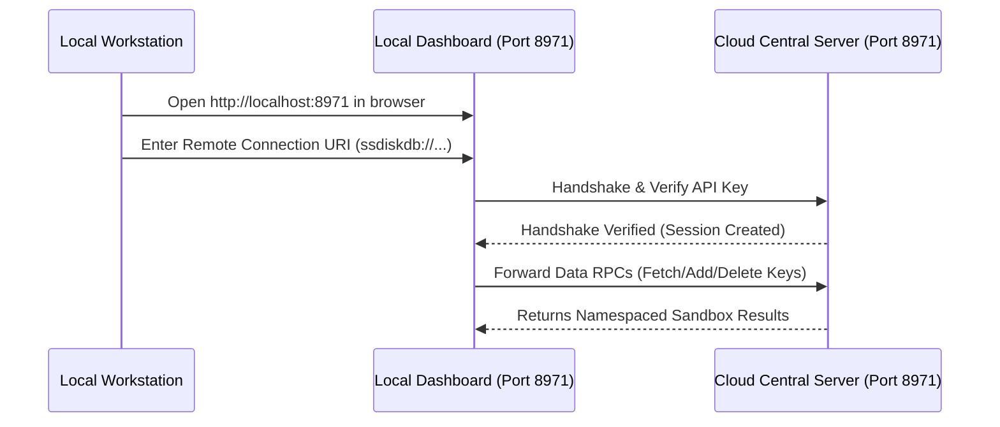

# SSDiskDB

[](https://www.npmjs.com/package/ssdiskdb)
[](https://github.com/ManojGowda89/ssdiskdb/blob/main/LICENSE)
[](https://github.com/ManojGowda89/ssdiskdb)
[](https://github.com/google/leveldb)
[](https://hub.docker.com/r/manoj20002/ssdiskdb)
[](https://github.com/ideawu/ssdb)

**SSDiskDB** is a high-performance, **open-source, embedded NoSQL database and key-value store built specifically for the JavaScript & Node.js community**, designed as a cost-effective, disk-backed alternative to Redis. It is built directly on top of [Google's LevelDB](https://github.com/google/leveldb) storage engine.

It is **not** a wrapper or client for the C++ SSDB database server; rather, it is a standalone, lightweight database library built from scratch in TypeScript by [Manoj Gowda](https://manojgowda.in) that brings Redis-like APIs (Strings, Hashes, Sorted Sets) directly to LevelDB. It is inspired by the design principles of SSDB and its production adoption by industry pioneers like Zerodha.

---

## 💡 Motivation & Inspiration (Inspired by SSDB & Zerodha)

The creation of **SSDiskDB** is inspired by **SSDB** and tech-industry pioneers like **Zerodha** (India's largest stock broker), who document their use of disk-backed databases in their [Zerodha Tech Stack](https://zerodha.tech/stack/).

### How the Author Discovered Disk-Backed Caching from Zerodha

During research into cost-efficient, high-volume caching architectures, the project's creator, Manoj Gowda, came across the public engineering disclosures of **Zerodha** (India's premier high-frequency stock brokerage). In their technical stack documentations published on [zerodha.tech](https://zerodha.tech), Zerodha's engineering team detailed how they self-host **SSDB** (an open-source, disk-backed NoSQL database utilizing Google's LevelDB engine under the hood) as a key-value cache.

In massive production environments, storing billions of keys in memory-only databases like Redis becomes prohibitively expensive due to RAM costs. By reading Zerodha's technical posts, Manoj learned how they leveraged SSDB to write records directly to SSDs while keeping a highly optimized memory cache for hot data. This hybrid architecture allowed them to achieve near-Redis latencies at a fraction of the cost, saving massive amounts of RAM and scaling cost-effectively.

This discovery inspired Manoj to build **SSDiskDB** from scratch specifically for the JavaScript & Node.js community. Instead of running a separate C++ SSDB daemon process, **SSDiskDB** implements these identical design principles inside an embedded Node.js library—bundling Google's LevelDB storage engine with a Redis-like API, connection pooling, security access whitelisting, and secure remote proxies.

---

## ⚡ Key Features

- ⚡ **Modern Promise-Based API**: Fully compatible with `async/await` syntax.
- 🔌 **Built-in Connection Pooling**: Manages HTTP/JSON-RPC sockets dynamically.
- 📦 **Automatic JSON Serialization**: Save and load objects, arrays, numbers, and booleans without manually calling `JSON.stringify` or `JSON.parse`.
- 🔒 **Client-Side AES-256-CBC Encryption**: Transparently encrypt values on write and decrypt on read. The central database only sees/stores ciphertext, ensuring zero-knowledge privacy in the cloud.
- 🔄 **Legacy Backward Compatibility**: Auto-detects and reads unencrypted legacy values safely without crashing or failing.
- 👥 **Dual-Mode Glassmorphic Dashboard**: A premium, responsive visual interface acting as either a Local Database Console or a Secure Remote Proxy to manage cloud servers.
- 🔑 **Allowed Server Whitelisting**: Lock down access using whitelisted server IDs, dynamic IPs, and reissuable API keys.
- 👥 **Role-Based Access Control (RBAC)**: Support for Read/Write Admins, Senior Developers, and Read-Only Junior accounts.
- 📘 **TypeScript Native**: Complete type safety and IDE autocomplete.
- 📦 **Dual ESM & CommonJS**: Ready for both modern and legacy runtime environments.

---

## ⚔️ Redis vs. SSDiskDB

| Feature | Redis | SSDiskDB |
| :--- | :--- | :--- |
| **Storage Medium** | Primarily RAM (In-Memory) | Disk-backed (using LevelDB Log-Structured Merge Tree) |
| **Data Capacity** | Constrained by available system RAM | Constrained by disk capacity (up to terabytes/petabytes) |
| **Operational Cost** | High (RAM is expensive at scale) | 10x to 100x Lower (SSD/Disk storage is cheap) |
| **Implementation** | C | TypeScript / Node.js (via LevelDB bindings) |
| **Data Structures** | Strings, Hashes, Lists, Sets, Sorted Sets, etc. | Strings, Hashes, Sorted Sets |
| **Encryption** | Transport Encryption (TLS) | Transport TLS + Client-Side Envelope Encryption (AES-256-CBC) |
| **Hosting Mode** | Standalone TCP Service | Local Embedded Library OR Client-Server REST Console |

### How SSDiskDB builds on top of LevelDB:
Google's LevelDB is a simple raw byte-stream key-value store. It has no built-in networking, server authorization, hashes, sorted sets, or encryption. 
SSDiskDB creates these structures on top of LevelDB:
1. **Data Types**: Implements prefix mappings (e.g. `s:key` for Strings, `h:name:key` for Hashes, and `z:name:key` for Sorted Sets) to map multi-dimensional structures into a single flat LevelDB keyspace.
2. **Dashboard & RPC**: Adds a secure HTTP JSON-RPC endpoint `/api/rpc` to allow remote nodes to request operations.
3. **Envelope Encryption**: Serializes data to JSON and encrypts it locally before sending it to LevelDB or over the wire, protecting the host disk from data leaks.

---

## 🛠️ Installation & Deployment

You can install and run SSDiskDB using three different methods depending on your environment:

### Method 1: Global/Local NPM Package
Install locally inside your Node.js application:
```bash
npm install ssdiskdb
```
Or install globally to gain direct command line interface (CLI) database operations:
```bash
npm install -g ssdiskdb
```

### Method 2: One-Command Shell Installer (macOS & Linux)
To run the database server and get instant global command access without manually setting up dependencies, run this single command from your terminal. It will auto-detect/install Node.js if missing, globally install the database, and configure shell path aliases:
```bash
curl -fsSL https://raw.githubusercontent.com/ManojGowda89/ssdiskdb/main/install.sh | bash
```

### Method 3: Cloud Docker Container
We provide a lightweight, pre-built Docker image hosted on Docker Hub, as well as a multi-stage `Dockerfile` to build from source.

#### Option A: Pull and Run pre-built Image from Docker Hub
To run the container directly (using persistent volume mount to `/data`):
```bash
docker run -d \
  -p 8971:8971 \
  -v ssdb-data-volume:/data \
  --name ssdiskdb-server \
  manoj20002/ssdiskdb:latest
```

#### Option B: Build and Run from Source
1. **Build the Docker Image:**
```bash
docker build -t ssdiskdb .
```

2. **Run the Container (with Volume Mount for Persistence):**
```bash
docker run -d \
  -p 8971:8971 \
  -v ssdb-data-volume:/data \
  --name ssdiskdb-server \
  ssdiskdb
```

*Docker deployment details:*
- **Port Mapping**: Map port `8971` to access the Insights Dashboard (e.g. `http://localhost:8971`).
- **Volume persistence**: The database is stored inside `/data` in the container. The `-v ssdb-data-volume:/data` flag ensures data is saved securely on host storage.
- **Volume Recommendation**: It is highly recommended to mount a persistent volume (`-v`) to prevent data loss when the container restarts or is rebuilt.

---

## 🚀 Connection Options

SSDiskDB can operate as a purely local cache inside your application, or as a central cache server shared across multiple remote client servers (VPC environment).

### 1. Local Mode Connection (Quick Start)
Stores data in the default folder `./ssdb-local-db`:
```js
const { connect } = require("ssdiskdb");

(async () => {
  const db = await connect();
  await db.set("name", "Manoj");
  console.log(await db.get("name")); // Manoj
  await db.close();
})();
```

To configure custom path, encryption (AES-256-CBC), or start the dashboard server:
```js
const db = await connect({
  storagePath: "./my-custom-data-dir",
  encryptionKey: "my-secure-key",
  startDashboard: true,
  dashboardPort: 8971
});
```

### 2. Connection URIs (Single String Config & Client-Side Encryption)
For simplified configuration, you can connect using a single URI containing the credentials, host, and server ID.

**Standard (Plaintext) URI:**
```js
const db = await connect("ssdiskdb://ssdb_c4dee067d4a23dd35da3270ddd5b2cc5@<central-server-ip>:8971/server-a");
```

**Encrypted URI (with Client-Side AES-256-CBC Envelope Encryption):**
Secure data transparently *before* it leaves your client server. Only the client has the encryption key; the central server only sees and stores ciphertext, providing full data privacy.
```js
const db = await connect("ssdiskdb+encry://ssdb_c4dee067d4a23dd35da3270ddd5b2cc5@<central-server-ip>:8971/server-a?key=your-secret-aes-key");
```

> [!IMPORTANT]
> **Startup Handshake**: During `connect()`, a remote client performs an immediate validation handshake with the central server. If the API Key is invalid, the server is blocked/restricted, or the endpoint is unreachable, `connect()` fails early throwing a descriptive error.
> 
> **Data Isolation**: The central server automatically isolates database operations. Client-set keys are prefixed behind the scenes (e.g. `s:client:server-a:mykey`). Operations like `flush()` or `getAllKeys()` are sandboxed to only affect the client's own namespace.

---

## 🖥️ Web Insights Dashboard & CLI

SSDiskDB comes equipped with a built-in web console similar to Redis Insights. It operates on port `8971` by default and allows you to view database statistics, search keys, add/edit cache entries, delete records, clear the database, and manage allowed client connections.

### Dual-Mode Dashboard UI (Local & Remote Proxying)
The dashboard features a premium glassmorphic dual-mode login console:
- **Local Database Mode**: Login with your admin or sub-account credentials to manage the local embedded LevelDB engine.
- **Remote Connection Mode**: Login using a connection URI (`ssdiskdb://...` or `ssdiskdb+encry://...`). When connected in Remote Mode, the dashboard serves as a secure reverse-proxy console. All keys, metrics, and CRUD operations are dynamically forwarded to the central server, while restricting access to local-only admin configurations (like allowed servers or sub-accounts).

---

## ☁️ Cloud Deployment & Secure Local-to-Cloud Setup

In a production environment, running an administrative dashboard directly exposed on the public internet is a major security risk. SSDiskDB solves this by allowing you to run the server headlessly on the cloud, and securely proxy data to your local workstation.



### Complete Walkthrough: Setting up Local Dashboard for Cloud Data

#### Step 1: Deploy SSDiskDB on your Cloud Server
Deploy the database container on your cloud VPS (e.g., AWS EC2 instance, DigitalOcean Droplet, GCP VM):
```bash
docker run -d \
  -p 8971:8971 \
  -v /var/lib/ssdb:/data \
  --name ssdiskdb-prod \
  manoj20002/ssdiskdb:latest
```

#### Step 2: Register a Console client
SSH into your cloud server and register an allowed connection for your local dashboard. This creates a secure, sandboxed client profile:
```bash
docker exec -it ssdiskdb-prod node dist/cjs/cli.js server add local-dev-console
```
This prints a unique API Key. For example:
`Registered local-dev-console with API Key: ssdb_c4dee067d4a23dd35da3270ddd5b2cc5`

#### Step 3: Copy the Connection URI
On your cloud server, copy the pre-formed connection URI. It follows this structure:
```
ssdiskdb://ssdb_c4dee067d4a23dd35da3270ddd5b2cc5@<your-cloud-ip>:8971/local-dev-console
```

#### Step 4: Open your Local Dashboard to Connect
1. On your local developer machine, start a local dashboard:
   ```bash
   npx ssdiskdb start --port 8971
   ```
2. Open `http://localhost:8971` in your web browser.
3. On the login screen, click the **Remote Connection** tab.
4. Paste the connection URI from Step 3 and click **Sign In**.
5. **Success!** Your local dashboard is now acting as a secure reverse-proxy console. You can view, search, and edit database records directly on the cloud server from your local machine, without exposing any management screens to the public web.

---

## 🛠️ CLI Reference

Manage admin credentials, whitelist connections, and start servers directly:

```bash
# Starts the local cache engine and opens the web dashboard on port 8971
npx ssdiskdb start

# Start on a custom port and database directory
npx ssdiskdb start --port 9000 --path ./my-custom-db

# Connect as a remote client using a connection URI (positional)
npx ssdiskdb start ssdiskdb://ssdb_key@localhost:8971/server-a

# Configure custom Admin Credentials
npx ssdiskdb credentials --username myuser --password mysecurepass --path ./my-custom-db

# Whitelist a remote client server (Auto-generates key)
npx ssdiskdb server add server-a --path ./my-custom-db

# List all allowed servers and their API Keys
npx ssdiskdb server list --path ./my-custom-db

# Remove allowed server access
npx ssdiskdb server remove server-a --path ./my-custom-db
```

---

## 📋 Production Hardening & Recommendations

1. **Volume Mount Persistence**: When running on Docker, always mount the persistent storage directory (e.g. `-v /var/lib/ssdb:/data`). LevelDB writes files on-disk; omitting this causes full data loss on container restarts.
2. **Reverse Proxy & SSL**: Do not expose the HTTP endpoint directly to the public internet. Use a reverse proxy like **Nginx** or **Caddy** to handle SSL termination (HTTPS) and route traffic to local port `8971`.
3. **Database Locking**: LevelDB is designed for single-process access and places a `LOCK` file in the database directory. If another Node.js process or CLI command attempts to open the same folder simultaneously, it will throw `LEVEL_LOCKED` (NotOpenError). For multi-process access, configure one central server process in Local Mode and connect all other clients in Remote Mode via HTTP connection URIs.
4. **Client-Side Envelope Encryption**: If deploying on public or untrusted cloud services, connect using the `ssdiskdb+encry://` protocol. Since data is encrypted locally using AES-256-CBC prior to transmission, anyone with physical access to the cloud server's storage disk will only see randomized ciphertext, preventing credential or data leaks.
5. **LevelDB Backups**: To back up the database, you can safely copy the LevelDB directory while the database is quiet. Do not copy the database directory while high-throughput writes are active, as this may copy a partial state of log/SST files.

---

## 👥 References

- **Manoj Gowda Portfolio**: [manojgowda.in](https://manojgowda.in)
- **Google LevelDB**: [github.com/google/leveldb](https://github.com/google/leveldb)
- **Official SSDB Database (Inspiration)**: [github.com/ideawu/ssdb](https://github.com/ideawu/ssdb)
- **SSDiskDB Repository**: [github.com/ManojGowda89/ssdiskdb](https://github.com/ManojGowda89/ssdiskdb)
- **SSDiskDB NPM Package**: [npmjs.com/package/ssdiskdb](https://www.npmjs.com/package/ssdiskdb)
- **Zerodha Tech Stack**: [zerodha.tech/stack](https://zerodha.tech/stack/)
- **Zerodha Tech Blog**: [zerodha.tech](https://zerodha.tech)
- **Docker Hub Repository**: [hub.docker.com/r/manoj20002/ssdiskdb](https://hub.docker.com/r/manoj20002/ssdiskdb)

---

## 📜 License

Apache-2.0
